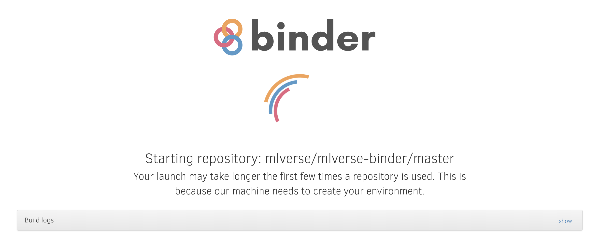
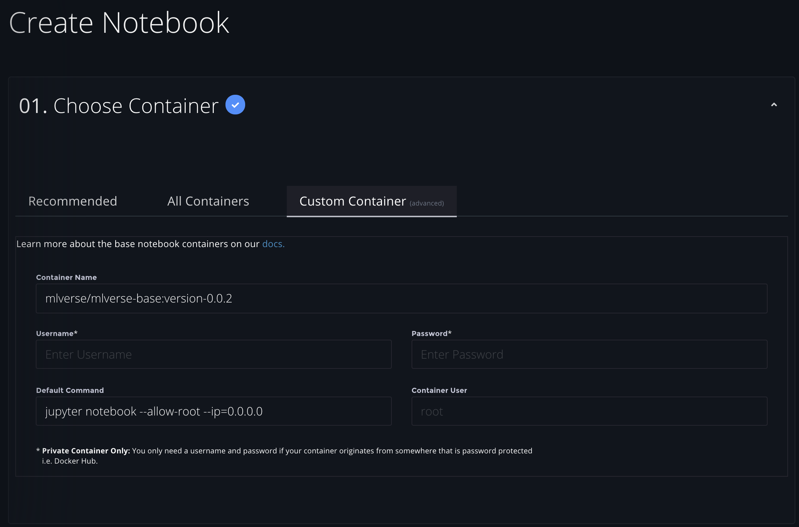
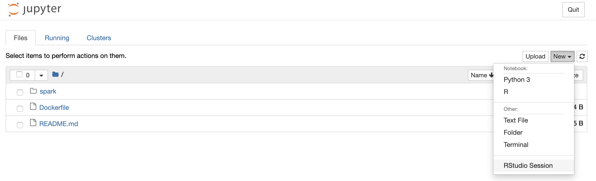

# MLverse Docker
[](http://mybinder.org/v2/gh/mlverse/mlverse-binder/master)

A docker image with support for: [TensorFlow](https://www.tensorflow.org), [Apache Spark](http://spark.apache.org), [MLflow](https://mlflow.org), [Apache Arrow](https://arrow.apache.org), [R](https://www.r-project.org/), [Python](https://www.python.org), [Jupyter](https://jupyter.org/) and [RStudio Server](https://www.rstudio.com/products/rstudio/download-server/).

This image can be used with [docker](#docker), [MyBinder](#mybinder), [Paperspace](#paperspace) and similar services.

## Docker

First pull the image as follows, replace the version as needed:

```bash
docker pull mlverse/mlverse-base:version-0.0.2
```

Then launch Jupyter and RStudio by initializing docker and the seessions,

```bash
docker run -d mlverse/mlverse-base:version-0.0.2 jupyter notebook --ip 0.0.0.0
```

When using cloud providers (like Google Clooud, Amazon AWS, etc), you can consider mapping ports to make the web sessions available online:

```bash
docker run -p 8888:8888  -d mlverse/mlverse-base:version-0.0.2 jupyter notebook --ip 0.0.0.0

docker ps
docker logs <container-id>
```
```
[I 14:50:15.151 NotebookApp] Writing notebook server cookie secret to /home/rstudio/.local/share/jupyter/runtime/notebook_cookie_secret
[I 14:50:15.446 NotebookApp] Serving notebooks from local directory: /home/rstudio
[I 14:50:15.447 NotebookApp] The Jupyter Notebook is running at:
[I 14:50:15.447 NotebookApp] http://c1162a81d10a:8888/?token=b711220eecc42b5ae9581d5319ad4ed44ca2f6d032d9b0bb
[I 14:50:15.447 NotebookApp]  or http://127.0.0.1:8888/?token=b711220eecc42b5ae9581d5319ad4ed44ca2f6d032d9b0bb
[I 14:50:15.447 NotebookApp] Use Control-C to stop this server and shut down all kernels (twice to skip confirmation).
[W 14:50:15.452 NotebookApp] No web browser found: could not locate runnable browser.
[C 14:50:15.452 NotebookApp] 
    
    To access the notebook, open this file in a browser:
        file:///home/rstudio/.local/share/jupyter/runtime/nbserver-1-open.html
    Or copy and paste one of these URLs:
        http://c1162a81d10a:8888/?token=b711220eecc42b5ae9581d5319ad4ed44ca2f6d032d9b0bb
     or http://127.0.0.1:8888/?token=b711220eecc42b5ae9581d5319ad4ed44ca2f6d032d9b0bb
```

Using the logs, you can then properly map the local ip `127.0.0.1` to the external ip provided by your cloud provider.

To launch this image as root use `-u` and `--allow-root`:

```bash
docker run -p 8888:8888 -u root -d <instance-id> jupyter notebook --ip 0.0.0.0 --allow-root
```

## MyBinder

To launch using [mybinder.org](https://mybinder.org), create a badge using this docker image. See [github.com/mlverse/mlverse-binder](https://github.com/mlverse/mlverse-binder).

[](https://github.com/mlverse/mlverse-binder)

## Paperspace

You can also use [free GPUs in Paperspace](https://blog.paperspace.com/paperspace-launches-gradient-community-notebooks/) with this image. When starting Paperspace, use `mlverse/mlverse-base:version-0.0.2` as the containere name and `jupyter notebook --allow-root -ip=0.0.0.0`.



## RStudio

RStudio Server sessions can starting an `RStudio Session` from the `New` dropdown.


