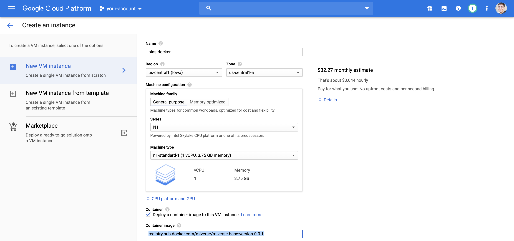

# MLverse Docker

A docker image with support for: [TensorFlow](https://www.tensorflow.org), [Apache Spark](http://spark.apache.org), [MLflow](https://mlflow.org), [Apache Arrow](https://arrow.apache.org), [R](https://www.r-project.org/), [Python](https://www.python.org), and [RStudio Server](https://www.rstudio.com/products/rstudio/download-server/).

## GPUs

Note that TensorFlow 2.0 and this docker image requires Cuda 10, [NVIDIA/nvidia-docker](https://github.com/NVIDIA/nvidia-docker/blob/master/README.md)is required and Cuda drivers must be installed in the host machine running docker.

## Docker

First pull the image as follows, replace the version as needed:

```bash
docker pull mlverse/mlverse-base:version-0.2.0
```

Then launch the image as follows,

```bash
docker run -p 8787:8787 -d mlverse/mlverse-base:version-0.2.0
```

You can then launch R or RStudio Server:

```bash
rstudio-server start
```

## Google Cloud Compute

From Google Cloud Compute, you can create a compute instance and specify the Docker image as,

```bash
registry.hub.docker.com/mlverse/mlverse-base:version-0.1.7
```



When using GPUs, consider using the boot disk,

```
Deep Learning Image: Base m37 (with CUDA 10.0)
A Debian based image with CUDA 10.0.
```

You can then connect to your instance and start this container,

```bash
docker run -p 8787:8787 -d mlverse/mlverse-base:version-0.2.0
```

When using GPUs launch as,

```bash
docker run --gpus all -p 8787:8787 -d mlverse/mlverse-base:version-0.2.0
```

Which you can then use to login as http://public-ip:8787 with username `rstudio` and password `rstudio`.


